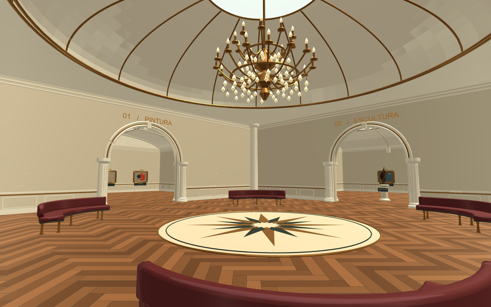

# Redesign do museu — 9 de setembro de 2026

O ambiente foi redesenhado como uma galeria palaciana clara, preservando o percurso
e as 28 fichas sobre a Semana de Arte Moderna de 1922. A referência foi a arquitetura
do Louvre: sequência de arcos, colunas e luz superior da
[Grande Galerie](https://www.louvre.fr/en/explore/the-palace/italian-painting-in-perspective),
com detalhes dourados inspirados na
[Galerie d’Apollon](https://www.louvre.fr/en/explore/the-palace/sun-and-gold).
É uma interpretação original para o projeto, sem pretensão de reproduzir uma sala real.

| Antes | Agora |
|---|---|
| Teto baixo e reto | Salão com cúpula, nervuras douradas e óculo luminoso |
| Passagens retangulares | Quatro portais em arco com colunas e inscrições |
| Piso escuro uniforme | Parquet em espinha, bordas de madeira e medalhão central |
| Luminárias simples | Lustre em dois níveis e claraboias nas galerias |
| Molduras em barras | 24 molduras douradas com perfis, filetes e cantos suaves |
| Volumes geométricos nas esculturas | Três bronzes orgânicos originais sobre pedestais circulares |
| Bancos retos concentrados no centro | Quatro bancos curvos, com estofado vinho e pés torneados |
| Ficha VR retangular | Cantos suaves e contorno bronze, mantendo os controles pelo olhar |

## Capturas da cena real

As imagens são renders mono do Unity, 1600×1000 com MSAA 4x para inspeção visual.
O aplicativo usa MSAA 2x. As capturas não medem qualidade ou desempenho no visor físico.

- [Salão frontal](louvre-hall.png)
- [Galeria de pintura](louvre-painting-gallery.png)
- [Galeria de escultura](louvre-sculpture-gallery.png)
- [Cúpula e lustre](louvre-ceiling.png)
- [Detalhe da moldura](louvre-frame-detail.png)
- [Cena anterior](before-louvre/museum-sculpture-gallery.png)

## Validação

- APK atualizado gerado em 9 de setembro; pacote e assinatura v2 verificados em 10 de setembro.
- Regressão 2D aprovada: 28 fichas, 12 cenários de estado, acessibilidade e integração.
- 28 fichas e respectivos raycasts preservados.
- Testes adicionais atingiram superfícies reais na parte superior das três esculturas.
- Quatro passagens verificadas com margem corporal de 25 cm; seis pontos com piso sólido.
- Uma única câmera ativa; controles de VR aprovados em Play Mode.
- Geometria agrupada por material e ambiente, com cerca de 163 mil triângulos na cena ativa.
  A medição considera os trechos de cada renderer nos meshes compartilhados por static batching.
- Seis luzes ativas; nenhuma gera sombras em tempo real. Luz ambiente e reflexos não dependem
  dos probes da arquitetura antiga. FPS, aquecimento e conforto precisam de medição no celular.

[Métricas da cena e evidências dos raycasts](louvre-geometry-metrics.json).

### APK atualizado

[Instalador Android](MuseumVR_Build/MuseudaSemanaArteModerna.apk): 33.578.493 bytes
(33,6 MB), ARM64, Android 8 ou superior. Biblioteca nativa Cardboard, código de
iluminação novo e objetos da cena redesenhada confirmados dentro do pacote.

SHA-256: `2da555e7923e996cbfb92f3a573fbdd78d91e71c1d147b90e4d0732e871cd677`.
[Registro da verificação do APK](louvre-apk-verification.json).

O pacote anterior foi preservado em `before-louvre/MuseuVR-before-louvre.apk`.

Durante a revisão foram corrigidos: teto antigo recriado no início, molduras antigas
reconstruídas por OnValidate, frestas nas extremidades das abóbadas, luz ambiente antiga,
vértices inválidos no fechamento das curvas e detecção incompleta das novas esculturas.
O setup pode ser reaplicado sem acumular arquitetura ou colliders das esculturas.

Os dados históricos e avisos de cenografia permanecem. As composições visuais e esculturas
são criações didáticas do projeto; não foram atribuídas como originais de artistas históricos.

## Manutenção

- Aplicar arquitetura: **Museum > Visual > Aplicar galerias inspiradas no Louvre**.
- Gerar APK: **Museum > VR Box > Gerar APK Android**.
- Testar a cena: `MuseumModerna.LouvreValidation.Run` em Unity batch mode, sem `-quit`.
- Fontes de geração: `LouvreMuseumSetup.cs` e `LouvreExhibitionDetails.cs` em `Assets/Editor`.
- Materiais, textura procedural, reflexo e meshes persistem em `Assets/MuseumStyle`.
- A arquitetura anterior permanece desativada em `Museum_Geometry`; o Blender não foi alterado.

Os arquivos auxiliares do kit externo citado pela skill de redesign não estavam instalados.
A verificação foi realizada com compilação C#, física real, Play Mode e renders do Unity.
